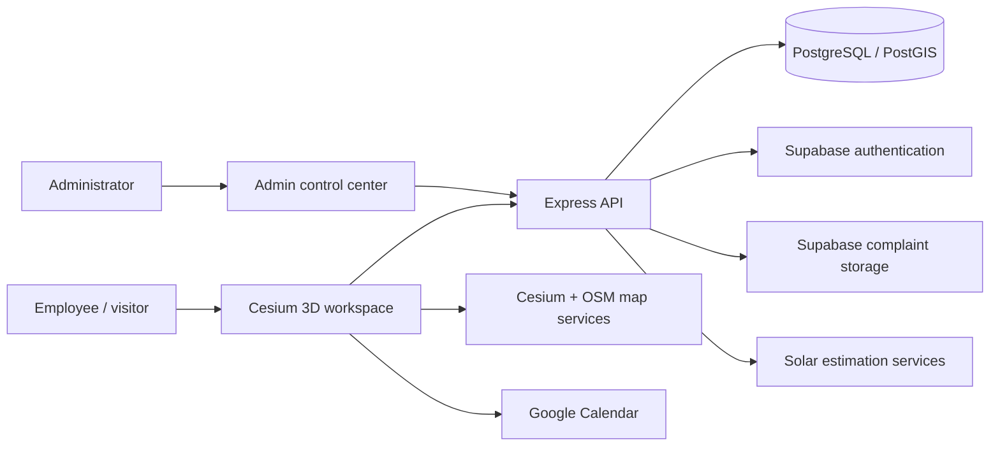
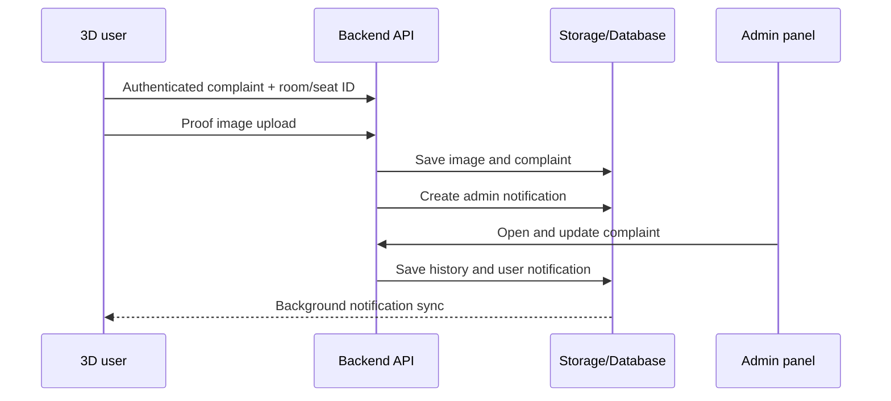
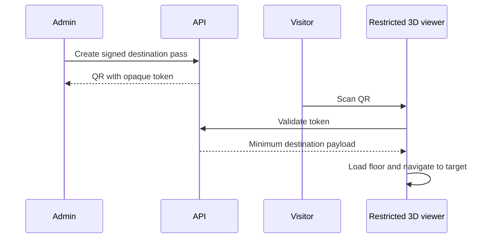

# Digital Twin Operations Platform — Feature Report

**Prepared:** 17 July 2026  
**Scope:** 3D user workspace, solar analysis, nearby amenities, administration, complaints, notifications, rooms, employees/seats, bookings, and visitor QR navigation.

## 1. Executive summary

The project is a connected digital-twin platform with three primary parts:

1. A Cesium-based 3D workspace for employees and visitors.
2. A protected administration panel for operational management.
3. An Express/PostgreSQL backend that supplies shared data, authentication, authorization, files, notifications, and reporting.

The current implementation already supports interactive floor models, room and seat selection, complaints with proof images, room bookings, notifications, rooftop solar analysis, nearby-amenity discovery, and administrator-generated QR links for rooms and seats.

The most important production gap is QR security. The present QR links provide a visually restricted kiosk experience, but they use editable URL parameters and currently resolve destinations only on floors 3 and 4. Before public deployment, QR links should use signed, expiring destination tokens validated by the backend.

## 2. System architecture



The viewer and admin panel do not maintain separate operational records. They communicate through the same backend, allowing an administrative change to appear in the user workspace after the next query or background synchronization.

## 3. 3D user workspace

### Implemented capabilities

- Interactive 3D building and floor visualization.
- Floor switching with floor-specific toolbar controls.
- Clickable rooms and employee seats/assets.
- Room detail cards containing floor, capacity, availability, and inventory data.
- Employee/seat cards using the assigned employee's full display name.
- Room booking through Google Calendar.
- Complaint creation for a selected room or employee seat.
- Notification center for announcements, direct messages, and complaint updates.
- Route and camera navigation to rooms and seats.
- Restricted kiosk display for scanned QR destinations.

### Interaction model

An authenticated employee selects a room or seat directly in the model. The system resolves the selected 3D object to its backend `object_key` or room identity, then presents relevant actions. Room actions include details, booking, and complaint creation. Seat actions include employee/seat details and complaint creation.

The visual object and operational record must remain linked through a stable identifier. For seats and equipment this is the asset `object_key`; rooms are currently matched using a normalized room name.

## 4. Solar analysis with 3D visualization

### User workflow

1. The user opens the Solar Workspace from floor 0.
2. The user selects an analysis date and mode.
3. Selecting **Analyze Punjabi Bagh** switches the viewer into the map-based solar mode.
4. The backend analyzes building footprints inside the selected bounding box.
5. All analyzed rooftops are rendered together in the Cesium scene using suitability/solar-performance colors.
6. Selecting a rendered building opens detailed building metrics.
7. Community and report tabs aggregate the results.

Solar controls are deliberately hidden on indoor floors 1–4 because those models do not provide useful rooftop-map context.

### Analysis capabilities

- Building footprint processing across a geographic bounding box.
- Free/live estimation mode and Google-based mode support.
- Date-sensitive irradiance calculations.
- Roof area and usable roof area.
- Daily and annual energy generation.
- Solar suitability score.
- Irradiance and shading estimates.
- Recommended panel capacity.
- Battery sizing.
- Electric-vehicle charging capacity.
- Financial estimates, subsidy, net investment, payback, and ROI.
- Carbon reduction, equivalent trees, and homes-powered indicators.
- Building-level and community-level analysis.

### Solar report exports

The viewer can export the completed analysis as:

- CSV for raw tabular analysis.
- GeoJSON for GIS and spatial workflows.
- Excel with community summary and per-building sheets.
- PDF with community metrics and a building table.

The existing PDF is data-focused. It does not yet embed a captured image of the 3D heatmap or charts. A future visual-report enhancement should capture the Cesium viewport and dashboard charts and place them into the PDF alongside the current data tables.

## 5. Nearby amenities with 3D visualization

### Implemented capabilities

- Nearby-place search using user/map coordinates.
- Category and radius filtering.
- PostGIS distance ordering for stored amenities.
- OpenStreetMap/Overpass and Nominatim integrations.
- Conversion of OpenStreetMap records into GeoJSON.
- Rendering of amenity entities in Cesium.
- Clickable 3D/map markers with detail handling.
- Outdoor routing support.
- Resolution of a selected point to its containing building footprint.

The amenity tool is available on floor 0 and hidden on indoor floors 1–4. This keeps indoor controls focused and prevents outdoor map features from appearing over unrelated floor models.

### Recommended visual enhancements

- Use category-specific 3D billboards for hospitals, food, transit, parking, banks, and emergency services.
- Cluster markers at wider zoom levels.
- Show walking distance and estimated journey time directly on the selected marker.
- Apply an accessible color and icon system rather than relying on color alone.

## 6. Administrative control center

### Current control areas

| Workspace | Administrative capability | User-panel effect |
|---|---|---|
| Dashboard | View live complaint, resolution, floor, and workload summaries | Operational overview only |
| Building/Floors | Manage building and floor records | Controls available floor data |
| Rooms | Create, edit, show/hide, delete, inspect, and generate QR codes | Changes room details and visibility |
| Bookings | View booking and organizer details | Read-only operational visibility |
| Employees/Seats | Create, edit, assign, delete, and generate QR codes | Changes 3D seat identity and employee details |
| Complaints | Inspect evidence/history, assign, reply, resolve, reject, or delete | Sends status/reply notifications to reporter |
| Users | View users, change role/active status, and send messages | Controls access and targeted notifications |
| Announcements | Create and manage announcements | Sends user-side announcements/notifications |
| Reports | Review sign-ins, actors, actions, affected records, dates, and times | Audit/insight function |
| Settings | Administrative configuration | Platform-level configuration |

### Control boundary

The admin panel controls shared operational data, access, communications, rooms, seats, and complaint workflows. It does not currently act as a live remote-control console for every open browser. For example, an administrator cannot forcibly move a user's camera or switch a user's current floor in real time. That kind of control would require a realtime command channel, device/session registration, command authorization, delivery acknowledgement, and a user-safety policy.

### Authorization

- Supabase validates Google-authenticated users.
- The backend verifies bearer tokens and loads the user's role from `profiles`.
- `requireAuth` protects employee actions such as complaint creation.
- `requireAdmin` protects management endpoints such as room creation, user changes, announcements, and complaint administration.
- Disabled profiles are rejected by the backend.

Client-side hiding is therefore not the primary security boundary; protected server routes enforce administrative access.

## 7. Complaint lifecycle

### Employee workflow

1. Sign in with Google.
2. Select a room or employee seat in the 3D model.
3. Choose **Raise Complaint**.
4. Enter issue type, priority, and description.
5. Optionally upload proof images.
6. Submit the complaint using the authenticated Supabase session.
7. Receive notification updates when an administrator replies, assigns, resolves, or rejects it.

The client refreshes an expiring access token and retries a failed authenticated request once, preventing a visually signed-in user from receiving a false authentication error due to a stale token.

### Administrator workflow

1. Receive a new-complaint notification.
2. Open the complaint detail view.
3. Review reporter, room/seat, issue, priority, timestamps, and uploaded proof.
4. Assign the work with notes and a deadline.
5. Reply to the reporter.
6. Resolve with resolution details or reject with a reason.
7. Review the full activity timeline.

### Data and safeguards

- Complaints can reference either an asset/seat or a room.
- Proof images are uploaded to the Supabase `complaints` bucket.
- Creation is rate-limited to reduce spam.
- Users can access their own complaint records; admins can access all records.
- Changes are retained in complaint history and reflected through notifications.

## 8. Notifications and communication

Notifications are intentionally directional:

- User actions, such as creating a complaint, notify administrators.
- Admin actions, announcements, replies, and direct messages notify affected users.
- A sender should not receive a duplicate notification for their own action.

Both panels support unread counts, notification lists, mark-as-read behavior, clickable detail views, and UI toast alerts for newly arriving records. Background synchronization should update the cache silently; historical events should not repeatedly toast after refresh.

## 9. Destination-specific QR access

### Current workflow

Administrators can generate a unique QR code from either the Rooms or Employees/Seats workspace. The QR encodes a viewer link such as:

```text
?mode=kiosk&floor=3&target=room&room=Conference%20Room
```

or:

```text
?mode=kiosk&floor=4&target=asset&objectKey=chair-4-27
```

After scanning:

1. The external visitor opens the 3D viewer in kiosk mode.
2. The target floor loads.
3. The room or seat is resolved.
4. The camera flies to the destination and the navigation route remains available.
5. Administrative, profile, notification, complaint, assistant, camera, and unrelated toolbar controls are hidden.

This gives the visitor a focused navigation experience rather than access to the complete employee workspace.

### Current limitations

- Destination resolution is currently restricted to floors 3 and 4.
- Room links rely on room names; stable room IDs would be more reliable after renaming.
- QR parameters are readable and editable.
- QR links do not currently expire or support revocation.
- Visual kiosk restrictions do not replace backend authorization.
- There is no scan audit containing issuer, destination, scan time, completion, or expiry.

### Production-grade QR design

Use a signed destination token instead of raw destination parameters:

```text
/visit/<opaque-signed-token>
```

The backend token record should contain:

- Token ID and signature.
- Destination type and immutable destination ID.
- Floor/building ID.
- Created by administrator ID.
- Created, valid-from, and expiry timestamps.
- Maximum scan/use count.
- Revoked flag and revocation time.
- Optional visitor label or visit purpose.

On scan, the backend validates the token and returns only the minimum public navigation payload. The kiosk client must not receive employee contact data, complaints, bookings, notifications, administrative APIs, or unrelated destinations. A short-lived anonymous navigation session can then be issued for route telemetry only.

## 10. Data flow examples

### Complaint flow



### QR navigation flow



The second diagram describes the recommended secured design; the current implementation embeds floor and target parameters directly in the QR URL.

## 11. Readiness assessment

| Feature | Current status | Production action |
|---|---|---|
| Interactive indoor 3D floors | Implemented | Optimize large 3D assets and test devices |
| Room and seat detail interaction | Implemented | Add automated object-link validation |
| Complaint creation and evidence | Implemented | Add file retention and moderation policy |
| Admin complaint lifecycle | Implemented | Add SLA escalation rules if required |
| Notifications and direct messaging | Implemented | Prefer realtime subscriptions at scale |
| Room calendar display/booking | Implemented | Complete Google OAuth verification and policy review |
| Solar 3D heatmap and metrics | Implemented | Validate assumptions against engineering data |
| Solar CSV/GeoJSON/Excel/PDF | Implemented | Add 3D/chart captures to visual PDF |
| Nearby amenities in Cesium | Implemented | Add clustering and accessibility review |
| Admin-generated room/seat QR | Implemented | Replace raw links with signed tokens |
| Destination-only kiosk UI | Partially implemented | Enforce server-side public-session policy |
| QR navigation on every floor | Partial | Generalize beyond floors 3 and 4 |
| Admin remote control of live viewers | Not implemented | Add only if operationally necessary |

## 12. Recommended delivery priorities

1. Secure QR navigation with signed, expiring, revocable tokens.
2. Generalize QR target resolution to every supported floor and use immutable IDs.
3. Add QR issuance and scan auditing to the admin Reports workspace.
4. Add screenshots of the Cesium heatmap and charts to solar PDF reports.
5. Add realtime delivery for operational notifications while preserving silent initial synchronization.
6. Add automated end-to-end tests for login, complaint upload, notification direction, room QR, seat QR, and solar floor switching.
7. Document solar assumptions, data provenance, accuracy limits, and engineering-disclaimer language.

## 13. Acceptance criteria

The platform can be considered ready for a controlled pilot when:

- An authenticated employee can select every mapped room/seat and submit a complaint with proof.
- The administrator can see and complete the entire complaint lifecycle.
- Every admin change is reflected in the appropriate user panel without a full-page reload.
- Solar analysis runs only in the correct map context and produces reproducible exports.
- Nearby amenities render, open details, and create a valid route.
- A QR visitor can reach only the assigned destination and cannot access employee/admin functions.
- QR tokens expire, can be revoked, and are logged.
- Role enforcement is confirmed at API level, not only through hidden UI.
- Mobile layouts have no horizontal overflow and all critical dialogs remain usable.

## 14. Conclusion

The project already demonstrates a strong operational digital twin: spatial context, business workflows, analytics, communication, and administration are connected rather than presented as isolated demos. Solar and amenity features make effective use of the map/3D context, while complaints and notifications connect physical objects to real operational action.

The next milestone should focus on secure visitor navigation and production hardening. In particular, signed QR access will turn the existing kiosk experience into a genuinely destination-limited external-user feature suitable for offices, campuses, service desks, and visitor reception.
